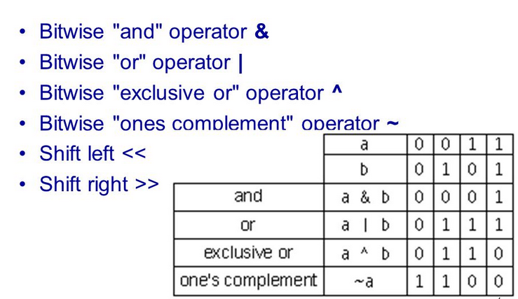

##Bitwise Operators

Normally as programmer, you dont have to worry about bit level operations, as 
the byte is the lowest level of data you can access and manipulate, you can always 
think in level of bytes, but something you might need to operate in a single bit. 
In C/C++ there is not data type call 'BIT', so every operation to a single bit must 
be apply at least to a complete byte, 

The following six are the bitwise operators for work at a bit-level

  

###Bitwise Applications 
Most of the bitwise operations are useful when we are in a low-level programming, for example: 
1. Interfacing with Hardware, you might need bit level access to control a DC motor.
2. GPIO for MCU, where each bit control 1 - 8 IO ports.
2. Register flags, each bit field can encode to boolean to represent if a flag is set or not.
3. Data compression, data encryption

The code in this repository is only for show some applications of the bitwise operators.

 
 
###References 
* https://www.cprogramming.com/tutorial/bitwise_operators.html
* https://www.testdome.com/questions/c/inspect-bits/
* https://www.geeksforgeeks.org/bitwise-operators-in-c-cpp/

  